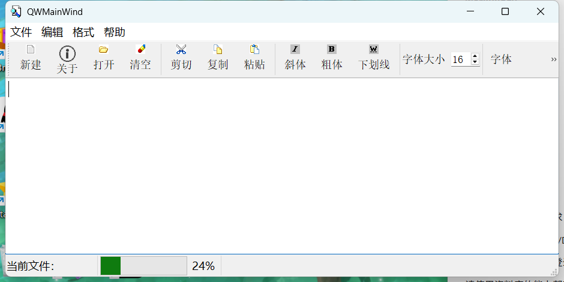
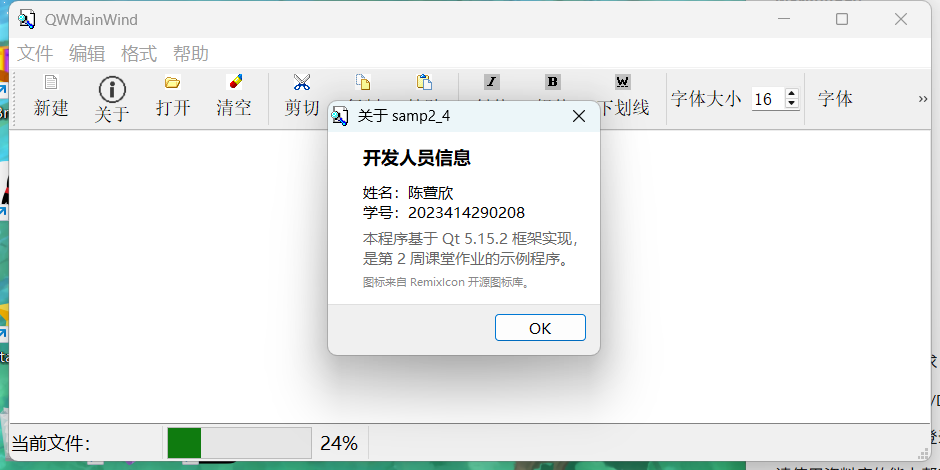
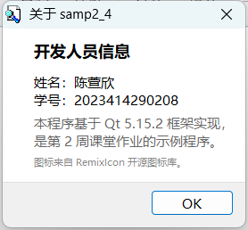

# QtCourse

《Qt 应用程序开发》课程作业仓库 —— **第 2 周作业**  
姓名：陈萱欣　学号：2023414290208  
GitHub 远程仓库：<https://github.com/chenxuanxin2023/QtCourse>

---

## 一、作业要求

1. 学习视频 <https://www.bilibili.com/video/BV1AX4y1w7Nt?p=5>，在示例代码中**增加一个工具按钮**，点击时可以显示一个 About 窗口，输出**姓名、学号**等信息。图标库可参考 <https://github.com/Remix-Design/RemixIcon>。
2. 注册 GitHub 账号，创建一个 `QtCourse` 仓库，并尝试同步 Qt 创建的本地仓库内容到 GitHub。

## 二、本次改动说明

示例程序为《Qt 5.9 C++ 开发指南》配套源码 `samp2_4`（一个简易文本编辑器）。

| 文件 | 改动内容 |
| --- | --- |
| `qwmainwind.ui` | 新增 `actAbout`（关于）动作：加入工具栏第 2 个位置、新增“帮助”菜单项、快捷键 `F1` |
| `qwmainwind.h` | 声明槽函数 `void on_actAbout_triggered();` |
| `qwmainwind.cpp` | 实现槽函数：用 `QMessageBox::about()` 弹出“开发人员信息”对话框，显示姓名、学号、Qt 版本 |
| `res.qrc` | 新增“关于”按钮图标资源 |
| `images/about.svg` | 来自 RemixIcon 图标库的 `information-line`（Apache-2.0） |
| `images/about.png` | 由 `about.svg` 生成的 32×32 按钮图标 |

## 三、核心代码

`qwmainwind.cpp`

```cpp
void QWMainWind::on_actAbout_triggered()
{//关于本程序——显示开发者姓名、学号等信息
    QString info = QString(
        "<h3>开发人员信息</h3>"
        "<p style='margin:6px 0;'>"
        "姓名：陈萱欣<br/>"
        "学号：2023414290208"
        "</p>"
        "<p style='margin:6px 0; color:#666;'>"
        "本程序基于 Qt %1 框架实现，<br/>"
        "是第 2 周课堂作业的示例程序。"
        "</p>"
        "<p style='margin:6px 0; color:#888; font-size:11px;'>"
        "图标来自 RemixIcon 开源图标库。"
        "</p>"
    ).arg(qVersion());
    QMessageBox::about(this, tr("关于 samp2_4"), info);
}
```

> 槽函数命名遵循 Qt 的**自动关联**规则 `on_<对象名>_<信号名>()`，因此无需手写 `connect`，uic 生成的 `connectSlotsByName()` 会自动完成关联。

## 四、运行环境与构建

- Qt 5.15.2（MinGW 8.1.0 64-bit）
- qmake + mingw32-make

```bash
# 1. 生成 Makefile
mkdir build && cd build
qmake ../samp2_4.pro -spec win32-g++

# 2. 编译（Release）
mingw32-make -f Makefile.Release

# 3. 运行（首次运行需把 Qt 的 dll 与 platforms/qwindows.dll 拷到 exe 同级目录）
./release/samp2_4.exe
```

## 五、运行截图

主界面（工具栏新增“关于”按钮，菜单栏新增“帮助”）：



点击“关于”按钮后弹出开发者信息窗口：





## 六、提交说明

- 任务一（About 窗口）：见 `screenshots/` 目录截图。
- 任务二（GitHub 同步）：本仓库即为同步结果，提交记录见 `git log`。
- 作业文档：`第2周作业-陈萱欣-完成版.docx`（含任务一运行截图、GitHub 仓库页面与推送成功截图）。
